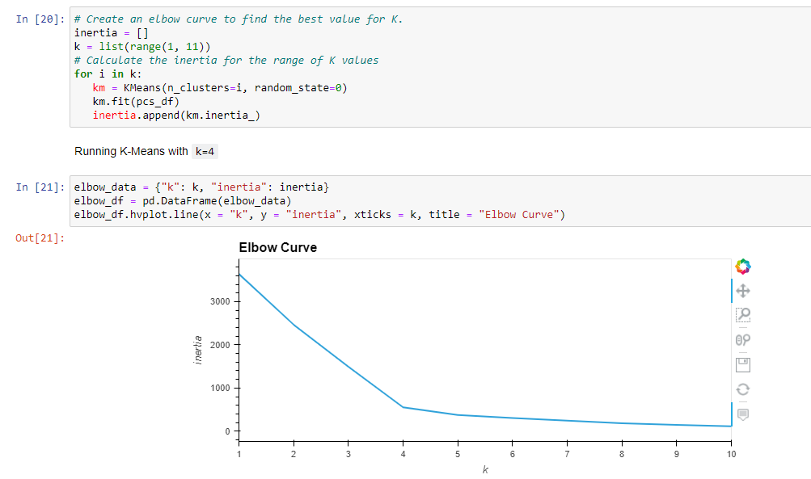
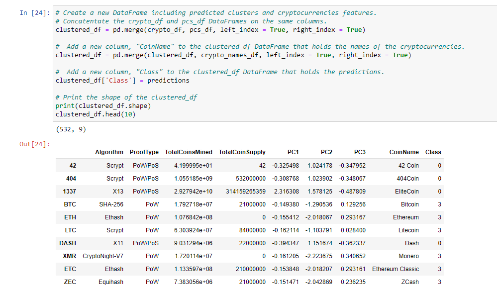

# Cryptocurrencies
Using clustering machine learning algorithms to group cryptocurrencies

## Overview
In this project, I have used R Studio to analyze manufacturing data for MechaCar. I analyzed: 
1) which features of car design influence average mileage per gallon; 
2) whether suspension coils across three production lots were produced to specifications.

After that, I finished up by creating a summary of an experimental design that may be used to determine the average sticker price of MechaCar's vehicles compared to their largest competitor's.

### Resources
Software: Jupyter Notebook, Python
Python packages: pandas, path, plotly, sklearn

[Data:](https://github.com/perryabdulkadir/Cryptocurrencies/tree/main/Resources) crypto_data.csv

## Analysis 

### Data Cleaning
After loading in the data frame, I dropped all cryptocurrencies that were not being traded. 

```
crypto_df = crypto_df[crypto_df['IsTrading'] != False]
crypto_df.shape
```
Next, I dropped the IsTrading column. 

```
crypto_df = crypto_df.drop(columns = ["IsTrading"])
crypto_df.head()
```
Then, I removed all rows that had any null values. 

```
for column in crypto_df.columns:
    print(f"Column {column} has {crypto_df[column].isnull().sum()} null values")
```

After that, I kept only the rows where more than 0 coins had been mined. 

```
crypto_df = crypto_df[crypto_df["TotalCoinsMined"] > 0]
```

Then. I created a new data frame to hold only cryptocurrency names and dropped the CoinName column to leave only the tickers.

```
crypto_names_df = crypto_df.drop(columns = ["Algorithm", "ProofType", "TotalCoinsMined", "TotalCoinSupply"])
```

```
crypto_df = crypto_df.drop(columns = ["CoinName"])
```
The last step in preparing the data was scaling the data. 

```
X = StandardScaler().fit_transform(X)
```

### Reducing Dimensions Using PCA

After this, I used PCA (Principal Component Analysis) to reduce the dimensions to three principal components. 


### Clustering Using K-Means

Elbow curves can be used to find an appropriate value for k.



The graph quickly levels out starting at 4, so that is the value I used for k. 

Next, I initialized and ran the k-means model. 


The last part of this analysis was creating a new data frame containing all the features of the cryptocurrencies alongside their predicted clusters. 




### Visualizing Cryptocurrency Results

I used a 3D plot to visualize the different classes. Each data point reveals the cryptocurrency it represents when hovered over. 


-----

### **Contact:**

**Email:** perry.abdulkadir@alumni.harvard.edu

**Linkedin:** https://www.linkedin.com/in/perry-abdulkadir-6a255199/
