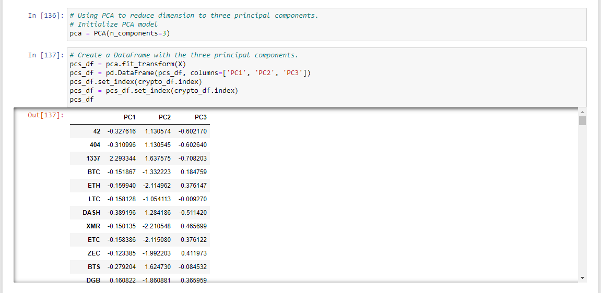
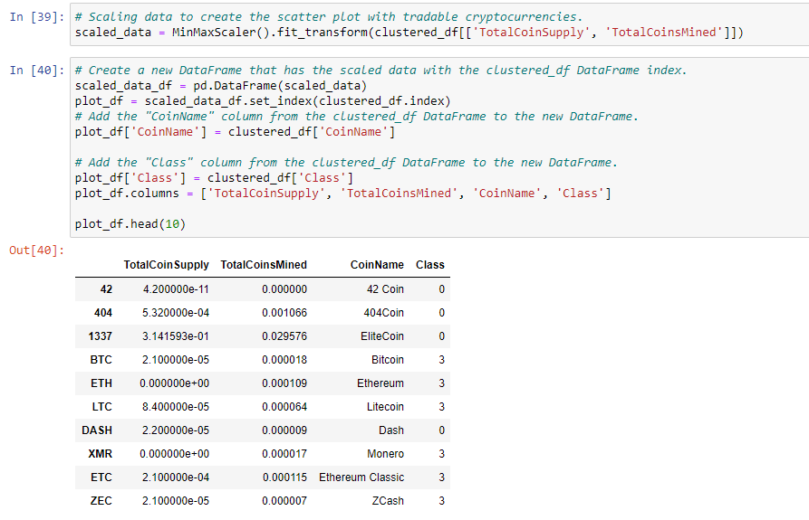
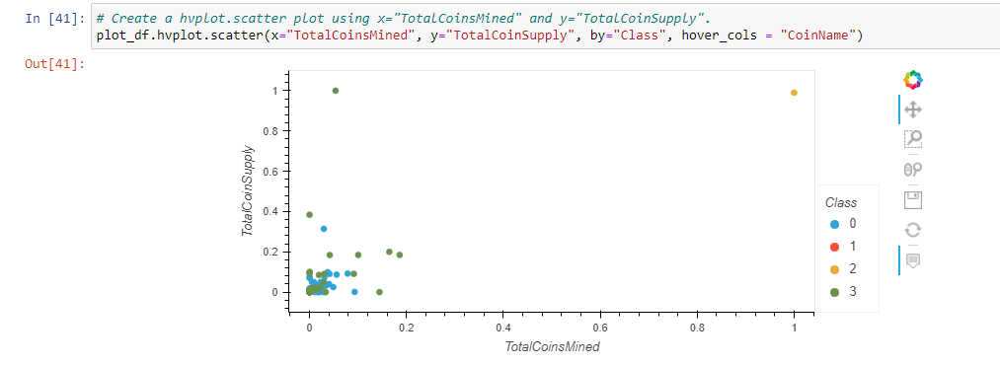

# Cryptocurrencies
Using clustering machine learning algorithms to group cryptocurrencies

## Overview
In this analysis, I use an unsupervised machine learning cluster algorithm to categorize cryptocurrencies so they may be more easily advertised and sold to clients. 
After cleaning the data, I used PCA (Principal Component Analysis) to reduce the number of features. I then ran a k-means clustering algorithm and created visualizations based on the results. 

### Resources
Software: Jupyter Notebook, Python
Python packages: pandas, path, plotly, sklearn

[Data:](https://github.com/perryabdulkadir/Cryptocurrencies/tree/main/Resources) crypto_data.csv

## Analysis 

### Data Cleaning
After loading in the data frame, I dropped all cryptocurrencies that were not being traded. 

```
crypto_df = crypto_df[crypto_df['IsTrading'] != False]
crypto_df.shape
```
Next, I dropped the IsTrading column. 

```
crypto_df = crypto_df.drop(columns = ["IsTrading"])
crypto_df.head()
```
Then, I removed all rows that had any null values. 

```
for column in crypto_df.columns:
    print(f"Column {column} has {crypto_df[column].isnull().sum()} null values")
```

After that, I kept only the rows where more than 0 coins had been mined. 

```
crypto_df = crypto_df[crypto_df["TotalCoinsMined"] > 0]
```

Then. I created a new data frame to hold only cryptocurrency names and dropped the CoinName column to leave only the tickers.

```
crypto_names_df = crypto_df.drop(columns = ["Algorithm", "ProofType", "TotalCoinsMined", "TotalCoinSupply"])
```

```
crypto_df = crypto_df.drop(columns = ["CoinName"])
```
The last step in preparing the data was scaling the data. 

```
X = StandardScaler().fit_transform(X)
```

### Reducing Dimensions Using PCA

After this, I used PCA (Principal Component Analysis) to reduce the dimensions to three principal components. 



### Clustering Using K-Means

Elbow curves can be used to find an appropriate value for k.


The graph quickly levels out starting at 4, so that is the value I used for k. 

Next, I initialized and ran the k-means model. 


The last part of this analysis was creating a new data frame containing all the features of the cryptocurrencies alongside their predicted clusters. 


### Visualizing Cryptocurrency Results

I used a 3D hvplot to visualize the different classes. Each data point reveals the cryptocurrency it represents when hovered over. 


My final visualization was an interactive scatter plot that plots total coin supply and total coins mined on the axes and uses colors to indicate which class a given cryptocurrency belongs to. I used the code below to scale the relevant variables and prepare the data to be plotted. 




This is the final chart, which displays the name of the cryptocurrency on hover-over.




## Summary and Recommendation
The large majority of cryptocurrencies fell into clusters 0 and 3. Cluster 2 only had one currency and cluster 1 only had 4. Going forward, it would be a good idea to check the market caps of clusters 1 and 2. If it turns out these coins have insignificant market caps, it may be worth removing them from the data set to provide a streamlined service for customers - choosing from two baskets of cryptos is easier than choosing from four, especially since one of the baskets isn't even really a "basket" at all, with just one coin. It would also be prudent to do analysis to determine what traits the clusters have in common. It would be much easier to sell customers a "new and emerging crypto fund," for example, as opposed to an abstract category.

-----

### **Contact:**

**Email:** perry.abdulkadir@alumni.harvard.edu

**Linkedin:** https://www.linkedin.com/in/perry-abdulkadir-6a255199/
